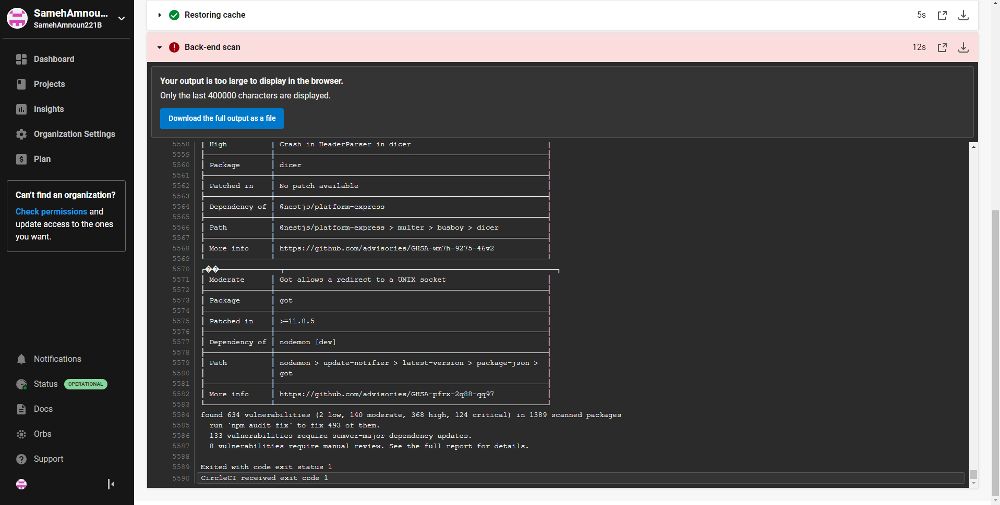
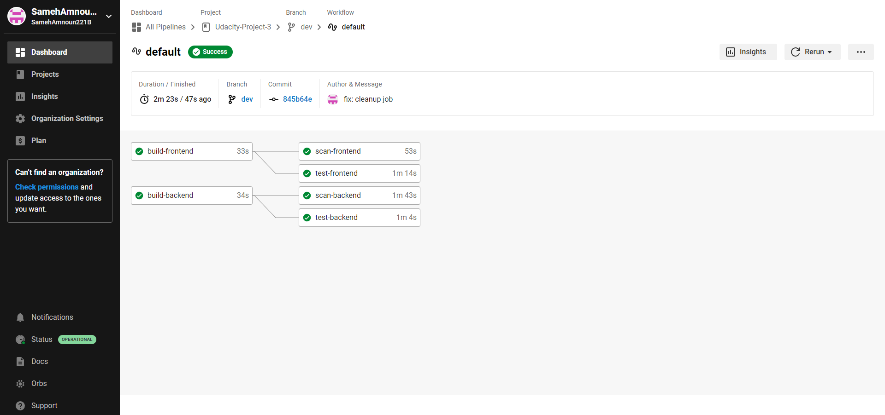

# Screenshots
## Screenshot 1 
## Screenshot 2 
## Screenshot 3 
## Screenshot 4 
## Screenshot 5 
## Screenshot 6 
## Screenshot 7 
## Screenshot 8 
## Screenshot 9 
## Screenshot 10 
## Screenshot 11-1 
## Screenshot 11-2 
## Screenshot 11-3 
## Screenshot 12 

# URL Screenshots

## Url 2 Screenshot 

## Url 3 Screenshot 

## Url 4 Screenshot 
## Url 5 Screenshot 